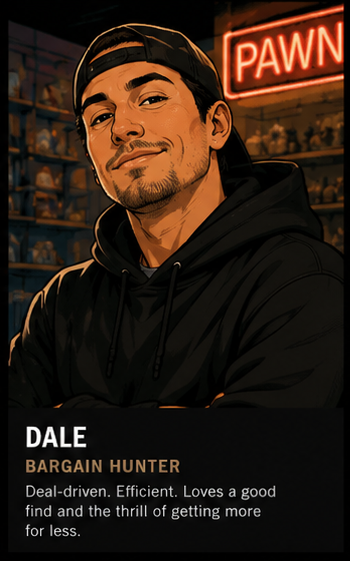
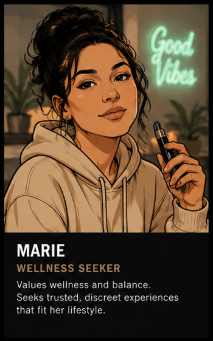
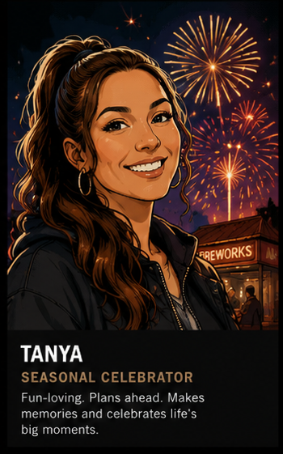
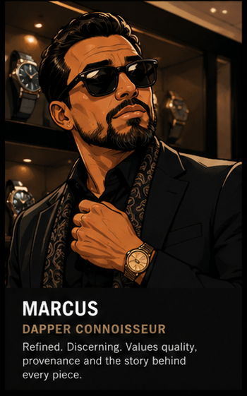
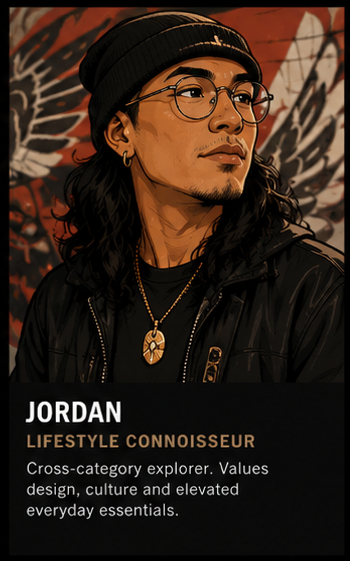
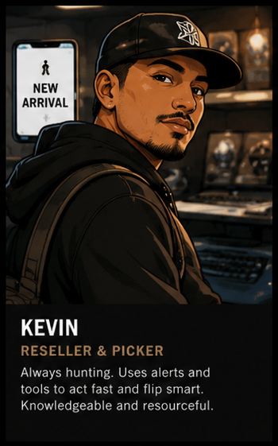
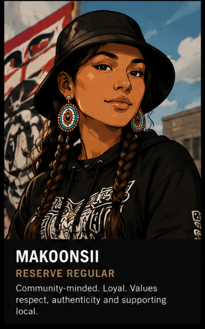
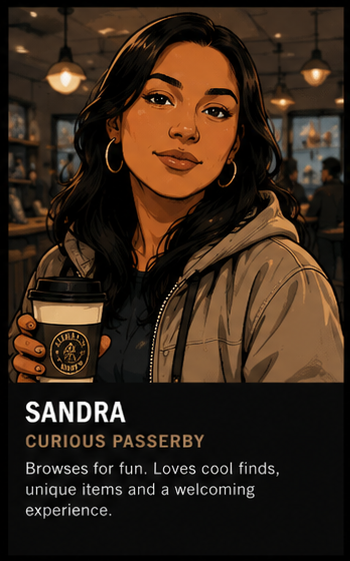

# User Personas

This document is the canonical record of all personas for The Pawn Shop. AI assistants, developers, and designers must consider these personas when designing UI, planning features, and writing copy. Every persona label used in GitHub Issues must correspond to an entry here.

**All 8 personas:** Dale · Marie · Tanya · Marcus · Jordan · Kevin · Makoonsii · Sandra

---

## 1. Dale — The Regular

* **Label:** `persona:dale`
* **Demographic:** 45, local resident of Cornwall / Akwesasne area.
* **Views Used:** Primarily Pawn, occasionally Cannabis.
* **Tech-Savvy:** Low to Medium. Needs clear, high-contrast UI and straightforward navigation.
* **Goals:** Quick transactions, easy browsing of inventory, serial number lookups, pawn form submissions.
* **Key Triggers:** Recently sold strip (social proof), clear pricing, familiar layout.
* **Design Notes:** High-contrast text, no modal walls, large tap targets, minimal steps to enquiry.

---

## 2. Marie — The Compliance Manager

* **Label:** `persona:marie`
* **Demographic:** 35, detail-oriented staff manager.
* **Views Used:** All views including Admin portal.
* **Tech-Savvy:** High. Uses the platform for reporting and oversight.
* **Goals:** Ensuring age-gate consent logs are correct, managing inventory across all views, generating PIPEDA compliance reports, reviewing pawn request status.
* **Key Triggers:** Audit log completeness, data retention dashboard, compliance checklist visibility.
* **Design Notes:** Dense information display is fine; prioritise data accuracy and audit trail completeness over visual polish.

---

## 3. Tanya — The First-Time Tourist

* **Label:** `persona:tanya`
* **Demographic:** 28, visiting the region, mobile-primary.
* **Views Used:** Cannabis, Fireworks.
* **Tech-Savvy:** High (mobile first).
* **Goals:** Exploring what's available, quick purchases, understanding legal limits, seamless mobile age verification.
* **Key Triggers:** Countdown timers (urgency), event category navigation, click-and-collect workflow, seasonal campaign banners.
* **Design Notes:** Mobile viewport (375px) is primary. Large tap targets. Fireworks bundle cards and cannabis mood collections must load fast.

---

## 4. Marcus — The High-Value Collector

* **Label:** `persona:marcus`
* **Demographic:** Late 30s–50s, affluent, cross-view browser, deep engagement sessions.
* **Views Used:** Pawn (primary), Cannabis, Fireworks.
* **Tech-Savvy:** Medium–High. Desktop and mobile.
* **Goals:** Finding rare and vintage items with provenance; expects luxury presentation and editorial context. Engages with Finds of the Week, staff picks, and AI-generated provenance copy.
* **Key Triggers:** `rare-find` and `limited-edition` tags, provenance notes in descriptions, cinematic photography, editorial articles (Warriors of Akwesasne series).
* **Design Notes:** Scarcity signals must be authentic — Marcus responds to genuine rarity, not manufactured urgency. Dark luxury aesthetic is his baseline expectation. Cross-view browsing flag (`crossViewBrowsing: true`) tracks his multi-view sessions in CRM.
* **CRM Signals:** High photography-click rate, long session duration, deep scroll on item detail, editorial engagement → VIP flag candidate.

---

## 5. Jordan — The Editorial Consumer

* **Label:** `persona:jordan`
* **Demographic:** 25–35, content-driven, social media native.
* **Views Used:** Pawn, Cannabis (editorial content).
* **Tech-Savvy:** High. Mobile and desktop.
* **Goals:** Reading articles, watching vertical video content, discovering the brand story. Engages with editorial CMS content and the brand's Akwesasne identity narrative.
* **Key Triggers:** Articles, vertical video on item detail pages, masonry discovery section, Instagram feed widget.
* **Design Notes:** Content-first layouts; vertical video support is a first-class requirement for Jordan's engagement path. Article pages need strong SEO and clean reading experience.

---

## 6. Kevin — The High-Frequency Enquirer

* **Label:** `persona:kevin`
* **Demographic:** 30–50, reseller or active secondary-market buyer.
* **Views Used:** Pawn (primary), all views for cross-category sourcing.
* **Tech-Savvy:** Medium–High.
* **Goals:** Electronics category subscriptions, rapid enquiry workflow, item holds, click-and-collect, SMS alerts for new inventory matching saved searches.
* **Key Triggers:** Notification centre, saved search alerts (< 60 seconds after listing), hold system, recently sold strip, reseller tier (bronze/silver/gold).
* **Design Notes:** Speed is critical — enquiry flow must be low-friction. Reseller registration form must be prominent. VIP tier and `resellerTier` field unlock priority access signals in the UI.
* **CRM Signals:** High-frequency enquiries → VIP flag candidate; reseller tier assignment by staff.

---

## 7. Makoonsii — The Community Trust Anchor

* **Label:** `persona:makoonsii`
* **Demographic:** Akwesasne community member, age range varies, mobile-primary.
* **Views Used:** Pawn (primary).
* **Tech-Savvy:** Low to Medium.
* **Goals:** Submitting pawn requests (including anonymous option), trusting the brand's community identity, browsing inventory without friction.
* **Key Triggers:** Brand narrative callout ("Community-owned · eBay verified · Akwesasne"), Kanien'kéha language presence, large touch targets, anonymous pawn submission path.
* **Design Notes:** Accessibility is non-negotiable — large touch targets, high contrast, keyboard-navigable. Makoonsii's presence validates the Akwesasne identity; every design decision touching brand copy should consider her trust relationship with the platform. **All Kanien'kéha phrases require community review before publication.**

---

## 8. Sandra — The Impulse Browser

* **Label:** `persona:sandra`
* **Demographic:** 25–45, social-media influenced, discovery-driven.
* **Views Used:** Pawn (primary), Cannabis.
* **Tech-Savvy:** Medium–High (mobile primary).
* **Goals:** Treasure-hunt browsing without a specific item in mind; responds to social proof, live activity, and curated discovery surfaces.
* **Key Triggers:** Masonry grid (Pawn homepage), recently sold strip, live activity feed ("Someone from Cornwall is viewing this"), staff picks, Finds of the Week.
* **Design Notes:** The masonry section and infinite scroll are built specifically for Sandra's browse pattern. Live activity feed must be privacy-safe (no PII, generalised location only). Quick-view modal (< 200ms) prevents her losing her place in the browse flow.

---

## Persona × View Matrix

| Persona | Pawn | Cannabis | Fireworks | Admin |
|---|---|---|---|---|
| Dale | Primary | Occasional | — | — |
| Marie | — | — | — | Primary |
| Tanya | — | Primary | Primary | — |
| Marcus | Primary | Yes | Yes | — |
| Jordan | Yes | Yes | — | — |
| Kevin | Primary | — | — | — |
| Makoonsii | Primary | — | — | — |
| Sandra | Primary | Yes | — | — |

## Validation Rule

No GitHub Issue or Epic file may reference a `persona:` label that is not defined in this document. The `sync-issues.mjs` script enforces this automatically.
